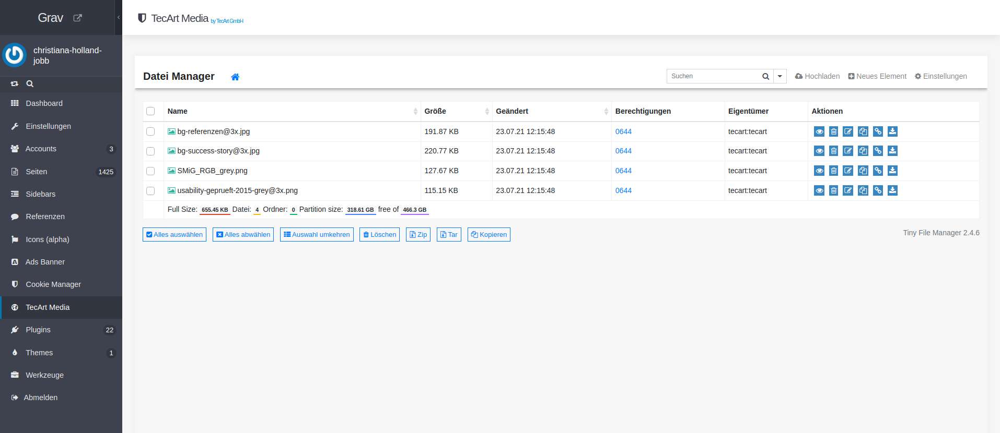

[](https://www.tecart.de)
# TecArt Media Plugin

The **TecArt Media** Plugin is an extension for [Grav CMS](http://github.com/getgrav/grav). Add a media folder to grav admin panel to manage images, videos etc.
To browse and handle files the open source project tinyfilemanager is included.

All uploaded files are stored in `/user/pages/tecart-media` folder. The folder is created automatically by the plugin if it doesn't exist yet.


## Installation

Installing the TecArt Media plugin can be done in one of three ways: The GPM (Grav Package Manager) installation method lets you quickly install the plugin with a simple terminal command, the manual method lets you do so via a zip file, and the admin method lets you do so via the Admin Plugin.

### GPM Installation (Preferred)

To install the plugin via the [GPM](http://learn.getgrav.org/advanced/grav-gpm), through your system's terminal (also called the command line), navigate to the root of your Grav-installation, and enter:

    bin/gpm install tecart-media

This will install the TecArt Media plugin into your `/user/plugins`-directory within Grav. Its files can be found under `/your/site/grav/user/plugins/tecart-media`.

### Manual Installation

To install the plugin manually, download the zip-version of this repository and unzip it under `/your/site/grav/user/plugins`. Then rename the folder to `tecart-media`. You can find these files on [GitHub](https://github.com//grav-plugin-tecart-media) or via [GetGrav.org](http://getgrav.org/downloads/plugins#extras).

You should now have all the plugin files under

    /your/site/grav/user/plugins/tecart-media

> NOTE: This plugin is a modular component for Grav which may require other plugins to operate, please see its [blueprints.yaml-file on GitHub](https://github.com//grav-plugin-tecart-media/blob/master/blueprints.yaml).

### Admin Plugin

If you use the Admin Plugin, you can install the plugin directly by browsing the `Plugins`-menu and clicking on the `Add` button.

## Configuration

Before configuring this plugin, you should copy the `user/plugins/tecart-media/tecart-media.yaml` to `user/config/plugins/tecart-media.yaml` and only edit that copy.

Here is the default configuration and an explanation of available options:

```yaml
enabled: true
```

Note that if you use the Admin Plugin, a file with your configuration named 'tecart-media.yaml' will be saved in the `user/config/plugins/`-folder once the configuration is saved in the Admin.

**Filemanager Congiuration**

Tinyfilemanager directory has to be stored in root of your Grav project because admin panel does not allow ajax calls of php files in sub folders of `user/plugins`.


The plugin automatically tries to create this folder and files in your root.

**NOTE**
If Filemanager is not shown in admin panel because folder could not be created

- Check permissions of your Grav project folder

or

- try to copy whole folder `user/plugins/tecart-media/vendor/tecart-media-filemanager` with all filesto your root as `tecart-media-filemanager`.
- check permissions of this folder

The Filemanager comes with the tecart media plugins standard configuration. You can do changes in root folder under `tecart-media-filemanager/config.php`.

```php
// Is independent from IP white- and blacklisting
$use_auth = false;

// Enable highlight.js (https://highlightjs.org/) on view's page
$use_highlightjs = true;

// highlight.js style
// for dark theme use 'ir-black'
$highlightjs_style = 'vs';

// Enable ace.js (https://ace.c9.io/) on view's page
$edit_files = true;

// Default timezone for date() and time()
// Doc - http://php.net/manual/en/timezones.php
$default_timezone = 'Etc/UTC'; // UTC

// Root path for file manager
// use absolute path of directory i.e: '/var/www/folder' or $_SERVER['DOCUMENT_ROOT'].'/folder'
$root_path = $_SERVER['DOCUMENT_ROOT'].'/user/pages/tecart-media';

// Root url for links in file manager.Relative to $http_host. Variants: '', 'path/to/subfolder'
// Will not working if $root_path will be outside of server document root
$root_url = '';

// Server hostname. Can set manually if wrong
$http_host = $_SERVER['HTTP_HOST'];

// user specific directories
// array('Username' => 'Directory path', 'Username2' => 'Directory path', ...)
$directories_users = array();

// input encoding for iconv
$iconv_input_encoding = 'UTF-8';

// date() format for file modification date
// Doc - https://www.php.net/manual/en/datetime.format.php
$datetime_format = 'd.m.y H:i:s';

// Allowed file extensions for create and rename files
// e.g. 'txt,html,css,js'
$allowed_file_extensions = '';

// Allowed file extensions for upload files
// e.g. 'gif,png,jpg,html,txt'
$allowed_upload_extensions = '';

// Favicon path. This can be either a full url to an .PNG image, or a path based on the document root.
// full path, e.g http://example.com/favicon.png
// local path, e.g images/icons/favicon.png
$favicon_path = '';

// Files and folders to excluded from listing
// e.g. array('myfile.html', 'personal-folder', '*.php', ...)
$exclude_items = array('tecart-media.md');

// Online office Docs Viewer
// Availabe rules are 'google', 'microsoft' or false
// google => View documents using Google Docs Viewer
// microsoft => View documents using Microsoft Web Apps Viewer
// false => disable online doc viewer
$online_viewer = 'google';

// Sticky Nav bar
// true => enable sticky header
// false => disable sticky header
$sticky_navbar = true;

// max upload file size
$max_upload_size_bytes = 999999;

// Possible rules are 'OFF', 'AND' or 'OR'
// OFF => Don't check connection IP, defaults to OFF
// AND => Connection must be on the whitelist, and not on the blacklist
// OR => Connection must be on the whitelist, or not on the blacklist
$ip_ruleset = 'OFF';

// Should users be notified of their block?
$ip_silent = true;
```

## Usage




All files are stored in `user/pages/tecart-media` folder.

That way, in Twig, you can reach them via
```yaml

```

Also you can find them easily via markdown and perform operations on them:

```yaml

```

See also Grav Docs for media usage: https://learn.getgrav.org/17/content/media

Use Folder in Blueprint

- as Filepicker
```yaml
file:
    type: filepicker
    folder: 'user/pages/tecart-media'
    preview_images: true
    label: vorhandenes Logo anzeigen
```

- as Fileupload
```yaml
fileUpload:
    name: iconImageUpload
    type: file
    limit: 1
    label: Logo
    destination: 'user/pages/tecart-media'
    multiple: false
    autofocus: false
    accept:
        - image/*
```

## Credits

**Tiny File Manager**

[](https://tinyfilemanager.github.io/demo/)
[](https://github.com/prasathmani/tinyfilemanager/wiki)
[](https://github.com/prasathmani/tinyfilemanager/releases)
[](https://github.com/prasathmani/tinyfilemanager/blob/master/LICENSE)
[](https://www.paypal.me/prasathmani)

> TinyFileManager is web based file manager and it is a simple, fast and small file manager with a single file, multi-language ready web application for storing, uploading, editing and managing files and folders online via web browser. The Application runs on PHP 5.5+, It allows the creation of multiple users and each user can have its own directory and a build-in support for managing text files with cloud9 IDE and it supports syntax highlighting for over 150+ languages and over 35+ themes.


## To Do

- [ ] Future plans, if any

## Known Issues

- N/A
